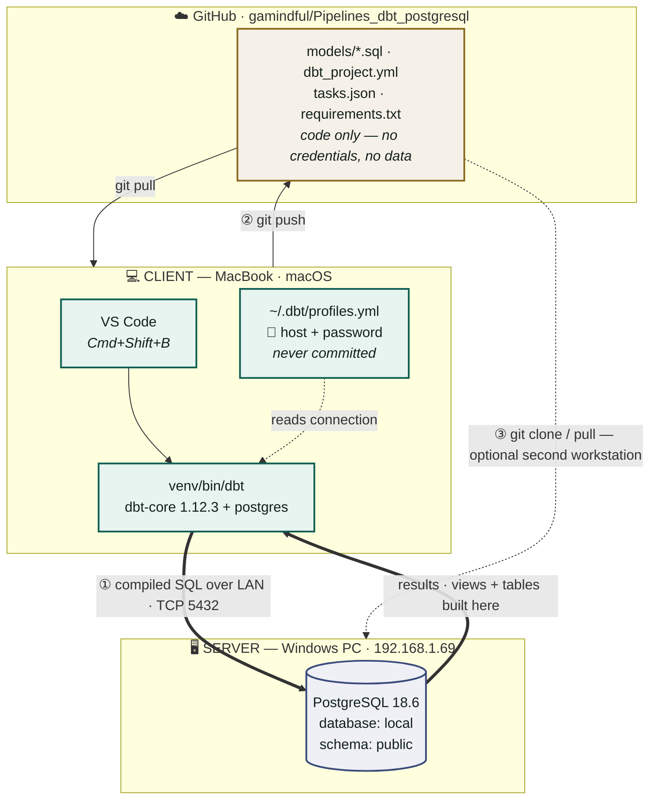

# How the three machines fit together

Two computers and one repository, joined by three independent channels. Nothing
crosses between them by accident — each arrow below is a separate mechanism that
had to be configured on its own.



### The three channels

**① Client → Server — LAN, TCP 5432.** dbt compiles the `.sql` files into real
SQL and sends it to Postgres, which builds the views and tables. **The data
never lands on the MacBook.** This is the channel that required
`listen_addresses`, `pg_hba.conf`, the Windows firewall rule and the Private
network profile — Steps 2 and 3.

**② Client ↔ GitHub — git.** Only source is versioned: models, project config,
tasks, dependency pins. Connection details stay in `~/.dbt/profiles.yml`,
outside the repository — which is what makes the repo safe to publish. Step 5.

**③ GitHub → Server — optional.** The Windows machine can clone the same repo
and run dbt against `localhost` instead of across the LAN. Worth doing for large
loads, since the data then never crosses the network. The models are identical;
only the `host:` in that machine's own `profiles.yml` differs.

> **The credential boundary is the point of this diagram.** Code flows through
> GitHub and is visible to anyone with repository access. The password exists
> only inside each machine's own `~/.dbt/profiles.yml` and travels only over
> channel ①, never through ②.


---
<details>
<summary><b>Pipelines_dbt_postgresql</b></summary>

dbt models targeting PostgreSQL 18.6 on a LAN server.

## Setup

    python3 -m venv venv
    ./venv/bin/pip install -r requirements.txt

Copy the profile block from `profiles.example.yml` into `~/.dbt/profiles.yml`
and fill in your own host and credentials. dbt reads it from there, not from
this repo -- which is why no credential is committed.

## Use

    ./venv/bin/dbt debug     # verify the connection
    ./venv/bin/dbt run       # build models
    ./venv/bin/dbt test      # validate them

</details>

---


<details>
<summary><b>How this environment was built</b></summary>

A record of every configuration change that took this project from nothing to a
working `git push`. Each step expands.

## Paths that had to change

The single most important table here. Three different binaries called `dbt`
and two called `python3` existed on this machine; getting the right one in each
place was most of the work.

| Role | Path | Notes |
|---|---|---|
| **Global Python** | `/Library/Frameworks/Python.framework/Versions/3.13/bin/python3` | Used **once**, only to create the venv. Nothing else uses it. |
| **Local Python** | `<project>/venv/bin/python3.13` | Everything runs on this. Pinned in VS Code. |
| **Local dbt** | `<project>/venv/bin/dbt` | dbt-core 1.12.3 with the `postgres` adapter. The one that works. |
| **Fusion dbt** *(neutralized)* | `~/.local/bin/dbt` → renamed `dbt-fusion` | 247 MB standalone binary. Was shadowing dbt-core and has **no Postgres adapter**. |
| **Credentials** | `~/.dbt/profiles.yml` | Deliberately outside the repo. Never committed. |

</details>

---

<details>
<summary><b>Connection config</b></summary>

A record of the steps taken on the **server** side (`192.168.1.69`, this Windows
machine) to stand up PostgreSQL 18 for `findata` and expose it safely to the
LAN — the counterpart to the client-side record below. Each step expands.

<details>
<summary><b>Step 1 — Confirm the existing install and network posture</b></summary>

PostgreSQL 18 was already installed and running as the `postgresql-x64-18`
Windows service before this work started, with `listen_addresses = '*'`, port
`5432`, an inbound firewall rule for 5432, and a `pg_hba.conf` entry for
`192.168.1.0/24` already in place — most of the "accept LAN connections" work
(the client repo's Step 2) had already been done.

```powershell
Get-Service -Name "postgresql*"
Select-String -Path "...\postgresql.conf" -Pattern "^listen_addresses|^port"
Get-Content "...\pg_hba.conf" | Select-String -Pattern "^[^#]"
ipconfig | Select-String "IPv4"
```

</details>

<details>
<summary><b>Step 2 — Grant the service account write access to the tablespace folder</b></summary>

The Postgres service runs as `NT AUTHORITY\NetworkService`, not the logged-in
user:

```powershell
(Get-WmiObject Win32_Service -Filter "Name='postgresql-x64-18'").StartName
# NT AUTHORITY\NetworkService
```

`CREATE TABLESPACE` pointed at a folder inside the project directory failed
with a permissions error until that account was granted rights explicitly:

```powershell
icacls ".\pgdata" /grant "NT AUTHORITY\NetworkService:(OI)(CI)F"
```

**Gotcha:** this grant is lost if the folder is ever deleted and recreated —
it had to be reapplied after the teardown in Step 11.

</details>

<details>
<summary><b>Step 3 — Create a dedicated tablespace and the <code>findata</code> database</b></summary>

```sql
CREATE TABLESPACE financial_tablespace
    LOCATION 'C:/.../Financial_analytics/pgdata/financial_tablespace';

CREATE DATABASE findata
    WITH TABLESPACE = financial_tablespace
    ENCODING = 'UTF8';
```

Keeps `findata`'s actual data files physically inside the project directory,
while every other database on the cluster (`postgres`, `template0/1`) stays on
the default tablespace, completely unaffected by anything done here.

</details>

<details>
<summary><b>Step 4 — Create a least-privilege application role and schema</b></summary>

```sql
CREATE ROLE app_findata WITH LOGIN PASSWORD :'app_password';
CREATE SCHEMA crypto_fx AUTHORIZATION app_findata;
GRANT CONNECT ON DATABASE findata TO app_findata;
GRANT USAGE, CREATE ON SCHEMA crypto_fx TO app_findata;
```

The password is generated with `RNGCryptoServiceProvider` and passed to
`psql` as a variable (`-v app_password=...`), so it never appears inside the
`.sql` file itself — only in the machine-local `.env`.

</details>

<details>
<summary><b>Step 5 — Define the schema: <code>assets</code> + <code>price_history</code></b></summary>

```sql
CREATE TABLE crypto_fx.assets (
    asset_id SERIAL PRIMARY KEY,
    symbol   TEXT NOT NULL UNIQUE,
    ...
);

CREATE TABLE crypto_fx.price_history (
    asset_id   INTEGER REFERENCES crypto_fx.assets(asset_id) ON DELETE CASCADE,
    trade_date DATE NOT NULL,
    ...
    UNIQUE (asset_id, trade_date)
);
```

One row per instrument, one row per instrument-day. The `UNIQUE` constraint on
`(asset_id, trade_date)` is what makes the loader's `ON CONFLICT` upsert
idempotent — safe to re-run after every download.

</details>

<details>
<summary><b>Step 6 — Install the toolchain (neither Python nor Git existed here)</b></summary>

```powershell
winget install --id Python.Python.3.12 -e
winget install --id Git.Git -e
```

**Gotcha:** each PowerShell command in this environment starts a fresh
process, so a plain `python`/`git` call right after install still failed —
`PATH` had to be re-derived from the registry (`HKCU` for the per-user Python
install, `HKLM` for the machine-wide Git install) and prefixed explicitly in
every subsequent command block, not just the one that ran the installer.

</details>

<details>
<summary><b>Step 7 — Install the Python packages</b></summary>

```powershell
python -m pip install yfinance psycopg2-binary sqlalchemy pandas python-dotenv
```

`yfinance` for the downloader, `sqlalchemy` + `psycopg2-binary` for the
loader, `python-dotenv` to read `.env` instead of hardcoding credentials.

</details>

<details>
<summary><b>Step 8 — Write the downloader/loader and fix the numpy-adaptation bug</b></summary>

`download_dataset.py` pulls OHLCV via `yfinance` into `datasets/*.csv`;
`load_dataset.py` upserts them into `crypto_fx`. The first load run failed:

```
psycopg2.errors.InvalidSchemaName: no existe el esquema «np»
LINE 5: (1, '2026-02-25'::date, np.float64(64077.769...
```

**Cause:** pandas/numpy scalar types (`np.float64`) aren't natively adapted by
psycopg2's `executemany`. **Fix:** a `_to_native()` helper that calls
`.item()` on numpy scalars and maps `NaN`/`NaT` to `None` before binding
parameters.

</details>

<details>
<summary><b>Step 9 — Scope <code>pg_hba.conf</code> to the specific database and role</b></summary>

Replaced the inherited broad rule with one scoped to just this project:

```diff
- host    all             all             192.168.1.0/24          scram-sha-256
+ host    findata         app_findata     192.168.1.0/24          scram-sha-256
```

```sql
SELECT pg_reload_conf();
```

Verified from the LAN address itself, not just assumed: `app_findata` →
`findata` succeeded; `app_findata` → `postgres` and `postgres` → `findata`
were both rejected with `no pg_hba.conf entry` — confirming the scoping
actually took effect, not just that the file parsed.

</details>

<details>
<summary><b>Step 10 — Keep secrets and binary data out of git</b></summary>

```
# .gitignore
.env
pgdata/
datasets/
```

`.env.example` is committed as a template with placeholder values instead —
mirrors the client repo's `profiles.example.yml` pattern.

```powershell
git init
git add -A
git commit -m "..."
```

</details>

<details>
<summary><b>Step 11 — Full teardown, and a UTF-8 BOM trap</b></summary>

On request, everything was torn down: `DROP DATABASE`, `DROP TABLESPACE`,
`DROP ROLE`, `pg_hba.conf` reverted, local project files deleted.

Recreating it afterward hit a new bug: PowerShell's `Set-Content -Encoding
utf8` writes a UTF-8 **BOM**. Round-tripping the generated password through a
temp file and Bash's `cat`/`sed` embedded that BOM into `.env`, silently
corrupting the password (auth failed with no obvious reason). Fixed by
trimming `U+FEFF` explicitly and writing the file with
`[System.Text.UTF8Encoding($false)]` (no BOM) — then verifying with a live
`psql` login *before* moving on, rather than trusting the file looked right.

</details>

<details>
<summary><b>Step 12 — Recreate the stack, reapplying the Step 2 grant</b></summary>

Deleting `pgdata/` during teardown also destroys the `NetworkService`
permission grant from Step 2 — `CREATE TABLESPACE` failed again with
`no se pudo definir los permisos del directorio` (permission denied) until
`icacls` was reapplied. Recreated tablespace → database → role → schema →
tables, then reloaded the same `datasets/` CSVs with `load_dataset.py`.

</details>

<details>
<summary><b>Step 13 — Install GitHub CLI</b></summary>

```powershell
python -m pip uninstall gh -y
winget install --id GitHub.cli -e
```

`gh --version` afterward reports the genuine `gh 2.98.0`.

</details>

</details>

---

<details>
<summary><b>Connection configuration</b></summary>

<details>
<summary><b>Step 1 — Create the local Python environment</b></summary>

The global Python is used exactly once, to bootstrap an isolated environment.
After this, nothing in the project touches system Python again.

```bash
cd dbt_config_repo
python3 -m venv venv
./venv/bin/pip install -r requirements.txt
```

`requirements.txt` pins the versions so the environment is reproducible:

```
dbt-core==1.12.3
dbt-postgres==1.11.0
psycopg2-binary==2.9.12
```

Verify:

```bash
./venv/bin/dbt --version     # Core: 1.12.3
```

</details>

<details>
<summary><b>Step 2 — Make the Windows server accept LAN connections</b></summary>

Four conditions must **all** be true. A failure in any one looks identical from
the client: a connection that hangs until timeout.

1. `postgresql.conf` → `listen_addresses = '*'` (default is `localhost` only)
2. `pg_hba.conf` → `host all all 192.168.1.0/24 scram-sha-256`
3. Windows Firewall → inbound TCP 5432 allowed
4. Network profile → **Private**, not Public

```powershell
Get-NetConnectionProfile          # must NOT say Public
New-NetFirewallRule -DisplayName "PostgreSQL 5432" -Direction Inbound `
  -Protocol TCP -LocalPort 5432 -Action Allow
Restart-Service postgresql-x64-18
```

`psql` is not on the Windows `PATH` by default:

```powershell
$env:Path += ";C:\Program Files\PostgreSQL\18\bin"
```

</details>

<details>
<summary><b>Step 3 — Use the LAN address, not the WSL gateway</b></summary>

The original configuration pointed at **`172.19.128.1`**, which produced a
20-second timeout on every attempt.

That address is the **WSL2 gateway**. It resolves to the Windows host *only from
inside a WSL virtual machine*. From any other device it is unroutable — packets
leave, hit the default gateway, and are dropped. Hence timeout rather than a
refusal.

The correct address is the machine's **LAN address**, found on Windows with:

```powershell
ipconfig | findstr /i "IPv4"      # take the 192.168.1.x, ignore 172.19.x
```

Here that is **`192.168.1.69`**.

**Reading failures:** `timeout` = wrong address or firewall. `connection
refused` = host reached, Postgres not listening there. `Host is down` = the
machine is off or asleep. `auth error` = networking already solved.

</details>

<details>
<summary><b>Step 4 — Create the database</b></summary>

`dbt debug` reported a UTF-8 codec crash rather than a useful message. The real
error, once decoded, was `no existe la base de datos «local»` — the database
simply did not exist.

```powershell
& "C:\Program Files\PostgreSQL\18\bin\psql.exe" -U postgres -c 'CREATE DATABASE "local";'
```

**Why the error was unreadable:** the server runs
`lc_messages = Spanish_Mexico.1252`. Its error text contains `«»` guillemets
(`0xAB`/`0xBB`), which are invalid UTF-8. psycopg2 assumes UTF-8, raises
`'utf-8' codec can't decode byte 0xab`, and the real cause disappears.

To decode such an error in Python:

```python
except UnicodeDecodeError as e:
    print(e.object.decode("latin-1", errors="replace"))
```

Permanent fix on the server — affects message text only, not data or collation:

```sql
ALTER SYSTEM SET lc_messages = 'C';
SELECT pg_reload_conf();
```

</details>

<details>
<summary><b>Step 5 — Configure the connection in <code>~/.dbt/profiles.yml</code></b></summary>

This file lives **outside the repository**. That is the entire reason this
project is safe to publish: the models, config and tasks are committed; the
host and password are not.

```yaml
pipelines_dbt_postgresql:
  target: dev
  outputs:
    dev:
      type: postgres
      host: 192.168.1.69
      port: 5432
      user: postgres
      pass: '...'
      dbname: local
      schema: public
      threads: 4
      connect_timeout: 5      # fail in 5s instead of 20 while debugging
```

`dbt_project.yml` refers to it **by name only**:

```yaml
profile: 'pipelines_dbt_postgresql'
```

No `.sql` file and no committed config contains a server address or credential.

</details>

<details>
<summary><b>Step 6 — Verify the connection</b></summary>

```bash
cd dbt_config_repo
./venv/bin/dbt debug
```

Expect `Connection test: [OK connection ok]` and `All checks passed!`.

**Always run dbt from the project directory.** dbt resolves `dbt_project.yml`
from the working directory and does not search subdirectories. Running from the
parent produced `Internal Error: Profile should not be None` — a cryptic message
caused by dbt having no project file to tell it which profile to use, made worse
by several profiles existing in `profiles.yml`.

Override when needed:

```bash
./venv/bin/dbt debug --project-dir Pipelines_dbt_postgresql
```

</details>

<details>
<summary><b>Step 7 — Stop the global Fusion binary from shadowing dbt-core</b></summary>

A separate 247 MB **dbt Fusion** binary sat at `~/.local/bin/dbt`. Because
`~/.local/bin` is on `PATH`, any non-activated shell resolved `dbt` to Fusion —
which supports snowflake, bigquery, databricks, redshift, duckdb, salesforce and
clickhouse, **but not postgres**:

```
[error] [InvalidConfig (dbt1005)]: The 'postgres' adapter is not yet
supported by dbt Fusion.
```

Rename it. Fusion stays installed and runnable under a name that cannot be
picked up by accident:

```bash
mv ~/.local/bin/dbt ~/.local/bin/dbt-fusion
```

Check which binary a shell would use:

```bash
type -a dbt
```

</details>

<details>
<summary><b>Step 8 — Pin the Python interpreter in VS Code</b></summary>

`.vscode/settings.json` — note the **absolute** path:

```json
{
  "python.defaultInterpreterPath": "dbt_config_repo/venv/bin/python3.13",
  "python.terminal.activateEnvironment": true
}
```

Then **Cmd+Shift+P → Python: Select Interpreter**, and **open a new terminal** —
terminals opened beforehand keep their old environment permanently.

Confirm both resolve inside the venv:

```bash
which python3; which dbt
```

*This file is gitignored* — it hard-codes a machine-specific path and is useless
on any other computer.

</details>

<details>
<summary><b>Step 9 — Run dbt from VS Code with a task, not the extension button</b></summary>

The dbt Labs extension (`dbtlabsinc.dbt`) **requires the Fusion engine**. It
ignores `dbt.dbtPath` and always launches Fusion, which cannot speak to
Postgres. It states this outright:

> This extension requires the dbt Fusion engine, and the dbt binary at
> `/Users/gamaliel/.local/bin/dbt` can't run `dbt lsp`.

No setting changes that. Use a task instead — `.vscode/tasks.json`:

```json
{
  "label": "dbt: run current model",
  "type": "shell",
  "command": "${workspaceFolder}/venv/bin/dbt",
  "args": ["run", "--select", "${fileBasenameNoExtension}"],
  "group": { "kind": "build", "isDefault": true }
}
```

**Cmd+Shift+B** runs the open model. Selection is by *model name*, not file
path, so one task serves every `.sql` file in `models/`.

**The `${workspaceFolder}` trap:** VS Code expands that variable in
`tasks.json` and `launch.json`, but **not** in arbitrary extension settings.
Using it in `dbt.dbtPath` silently produced a literal, unresolvable path — which
is why the extension fell back to Fusion. Extension settings need absolute
paths; tasks do not.

For a working button, lineage and previews on dbt-core, use **dbt Power User**
(`innoverio.vscode-dbt-power-user`, by Altimate AI) instead.

</details>

<details>
<summary><b>Step 10 — Open the project folder as the workspace root</b></summary>

Open **`Pipelines_dbt_postgresql`** itself, never the parent. Three separate
mechanisms depend on it:

1. **dbt** resolves `dbt_project.yml` from the working directory.
2. **VS Code** reads `.vscode/` only at the workspace root — open the parent and
   your tasks and interpreter pin vanish silently.
3. **`${workspaceFolder}`** resolves to whatever was opened, so tasks would
   point at a `venv/` that does not exist there.

For several projects at once, use *File → Add Folder to Workspace* — a
multi-root workspace keeps each folder's `.vscode/` active.

</details>

<details>
<summary><b>Step 11 — Write models</b></summary>

A dbt model is just a `SELECT`. dbt supplies the connection and wraps it in
`create view as`. Models contain **no** connection details.

`models/stg_tables.sql`:

```sql
select table_schema, table_name, table_type
from information_schema.tables
where table_schema not in ('pg_catalog', 'information_schema')
```

`models/table_summary.sql` — `ref()` builds the DAG and the run order:

```sql
{{ config(materialized='table') }}

select table_schema, count(*) as table_count
from {{ ref('stg_tables') }}
group by table_schema
```

```bash
./venv/bin/dbt run
./venv/bin/dbt show --select table_summary --limit 20
```

</details>

<details>
<summary><b>Step 12 — Publish to GitHub</b></summary>

`.gitignore` must exclude the venv, build artifacts and any credential file:

```
target/
dbt_packages/
logs/
venv/
profiles.yml
.vscode/settings.json
.DS_Store
```

A plain `git push` to a repository that does not exist yet fails with
`repository not found` — GitHub returns 404 rather than 403 so it does not leak
whether private repositories exist. The `gh` CLI creates and pushes in one step:

```bash
brew install gh
gh auth login
git remote remove origin
gh repo create Pipelines_dbt_postgresql --private --source=. --remote=origin --push
```

GitHub disabled password authentication for HTTPS in 2021, so the manual route
needs a Personal Access Token with the `repo` scope — `gh` avoids that entirely.

Always confirm before pushing:

```bash
git status --short                                     # nothing unexpected staged
grep -rn "<your-password>" . --exclude-dir=.git --exclude-dir=venv
```

</details>

<details>
<summary><b>Step 13 — Keep local and remote in sync</b></summary>

The ongoing loop:

```bash
cd dbt_config_repo
git add -A
git status --short          # review before committing
git commit -m "..."
git push
```

Confirm the two match — no `ahead`/`behind`, empty diff:

```bash
git fetch && git status -sb && git diff origin/main --stat
```

If the remote also changed, rebase local work on top before pushing:

```bash
cd dbt_config_repo && git pull --rebase && git push
```

</details>

</details>
